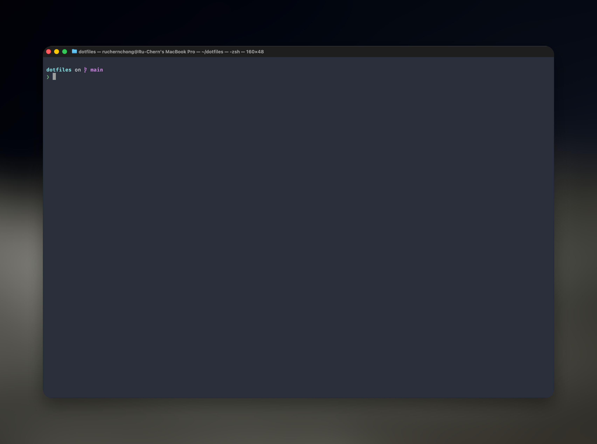

# Ru Chern's Dotfiles

This repository contains dotfiles and scripts that I use to customize my macOS/Linux development workflow. Feel free to use this as a reference for your own setup.



## Table of Contents

- [Features](#features)
- [Installation](#installation)
  - [OTA Installation](#ota-installation)
  - [Manual Cloning](#cloning-the-repository)
- [System Requirements](#system-requirements)
- [Configurations](#configurations)
- [Feedback](#feedback)
- [License](#license)

## Features

- Installs Oh-My-Zsh by default
- Comprehensive git aliases for daily use
- Customized oh-my-zsh settings
- [Automated setup script](setup.sh)

## System Requirements

### Supported Platforms

- macOS (10.15+)
- Linux (Ubuntu 20.04+, Fedora 33+)

### Prerequisites

- Zsh
- Git
- Homebrew (macOS)
- curl

## Configurations

### Zsh Customizations

- Custom Oh-My-Zsh theme configuration
- Key plugins:
  - zsh-autosuggestions
  - zsh-syntax-highlighting
  - git
  - docker

### Git Aliases

- `g` → `git`
- `gp` → `git pull`
- `gps` → `git push`
- Custom commit and branch management shortcuts

## Installation

**Warning:** Do not blindly use these settings as they may override or modify your existing configuration. It is highly recommended to clone/fork this repository to another folder. Use at your own risk!

### OTA Installation

```zsh
curl -L https://raw.githubusercontent.com/ruchernchong/dotfiles/master/install.sh | bash
```

### Cloning the Repository

```zsh
git clone https://github.com/ruchernchong/dotfiles.git $HOME/dotfiles
cd $HOME/dotfiles
chmod a+x setup.sh
source setup.sh
```

## Feedback

I welcome any feedback or suggestions by creating an [issue](https://github.com/ruchernchong/dotfiles/issues) or a [pull request](https://github.com/ruchernchong/dotfiles/pulls).

## License

This code is available under the [MIT License](LICENSE)
